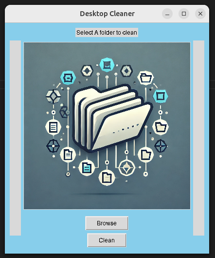

# File Organizer Application

This application organizes files into different folders based on the file types. It provides a user-friendly interface where you can select a folder path and clean up the folder by sorting files into appropriate subfolders.


Screenshot.png
## Features
- Organizes files into different folders (e.g., documents, images, videos) based on file types.
- Simple and intuitive UI.
- Easy to select a folder path and clean it with just one click.

## How to Run the Application

1. Create a virtual environment:
   ```bash
   python -m venv .venv
   ```

2. Activate the virtual environment:
   - For macOS/Linux:
     ```bash
     source .venv/bin/activate
     ```
   - For Windows:
     ```bash
     .venv\Scripts\activate
     ```

3. Install the required dependencies:
   ```bash
   pip install -r requirements.txt
   ```

4. Run the application:
   ```bash
   python main.py
   ```

Once the application starts, a user interface will be displayed. Use the "Browse" button to select the folder path you want to clean. After selecting the folder, click the "Clean" button to organize the files in the selected folder.
